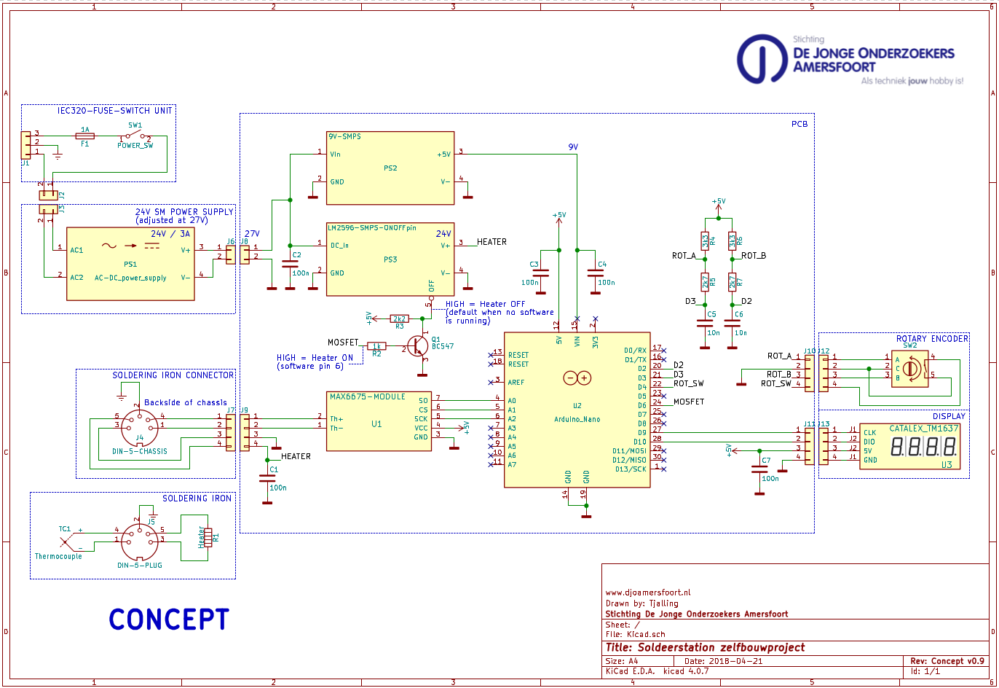

Adjustable Soldering Iron
=========================

An adjustable soldering iron with temperature display using Arduino. It uses a TM1637Display driver to connect to a 4 digit display. The temperature is acquired using the MAX6657 thermocouple interface. Both of these require additional software found below:

- [TM1637 Display library by avischorp](https://github.com/avishorp/TM1637)
- [MAX6675 Thermocouple library by adafruit](https://github.com/adafruit/MAX6675-library)

To install them, download both repositories as a zip file, and include them using the "Add .ZIP Library" option in the Arduino "Sketch" menu. To keep the software easy to understand, some nice to have features are not included.

## Hardware

This project is aimed at members of DJO Amersfoort and therefor uses a fairly specific parts configuration. The soldering iron used is a German 48W/230VAC VTSSC10N/SP made by Velleman. The schematic is visible below, and is also provided as a pdf file.

## License

The software is made by:

- Jelmer van Arnhem
- Camiël vd Niet
- Sieuwe Elferink

The schematic is made by:

- Tjalling Brouwer

DJO Amersfoort holds the copyright for all files in this repository,
but they can be copied under the terms of the MIT license, see the LICENSE for details.
